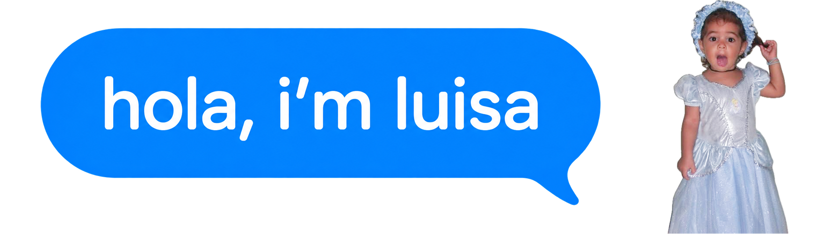
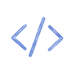
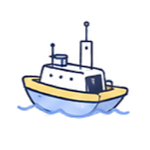
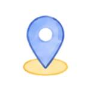
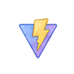
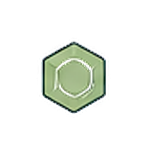
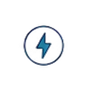
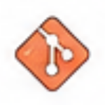
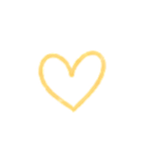

##  &nbsp; about me

 &nbsp; systems & computing engineering student @ UTB 
 &nbsp; software developer interested in web, cloud, data & IoT 
 &nbsp; i like turning ideas into things that actually work

##  &nbsp; currently building

**sentinel hmi** — a human-machine interface for an unmanned surface vehicle. 
real-time data, maps, visualization and vehicle control. 

 &nbsp; react
&nbsp;&nbsp;
 &nbsp; typescript
&nbsp;&nbsp;
 &nbsp; python
&nbsp;&nbsp;
 &nbsp; iot
&nbsp;&nbsp;
 &nbsp; recharts
&nbsp;&nbsp;
 &nbsp; leaflet

##  &nbsp; toolbox

 &nbsp;
 &nbsp;
 &nbsp;
 &nbsp;
 &nbsp;
 &nbsp;
 &nbsp;
 &nbsp;

 &nbsp;
 &nbsp;
 &nbsp;
 &nbsp;

##  &nbsp; let's connect

   [linkedin.com/in/lutriana](https://www.linkedin.com/in/lutriana/)
&nbsp;&nbsp;&nbsp;&nbsp;&nbsp;&nbsp;
   [luisasportfolio.io](https://luisasportfolio.io)
&nbsp;&nbsp;&nbsp;&nbsp;&nbsp;&nbsp;
   [instagram.com/codesluli](https://www.instagram.com/codesluli/)
&nbsp;&nbsp;&nbsp;&nbsp;&nbsp;&nbsp;
   [codesluli@gmail.com](mailto:codesluli@gmail.com)

 

 &nbsp; build · learn · improve · repeat &nbsp; 

