

  

<samp>systems engineer · software developer · builder</samp>

  

&nbsp;&nbsp;&nbsp;

&nbsp;&nbsp;&nbsp;

&nbsp;&nbsp;&nbsp;

 

<h2>
  
  &nbsp; about me
</h2>

<table>
  <tr>
    <td width="50">
      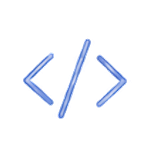
    </td>
    <td>
      systems & computing engineering student @ UTB
    </td>
  </tr>
  <tr>
    <td>
      
    </td>
    <td>
      software developer interested in web, cloud, data & IoT
    </td>
  </tr>
  <tr>
    <td>
      
    </td>
    <td>
      i like turning ideas into things that actually work
    </td>
  </tr>
</table>

 

<h2>
  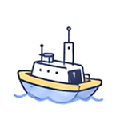
  &nbsp; currently building
</h2>

<table>
  <tr>
    <td width="70">
      
    </td>
    <td>
      <strong>Sentinel HMI</strong> 
      
        a human-machine interface for an unmanned surface vehicle
        combining real-time sensor data, maps, visualization and control.
      
    </td>
  </tr>
</table>

 

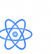
&nbsp;

&nbsp;

&nbsp;
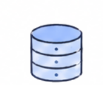

 

react · typescript · python · iot · real-time data

 

<h2>
  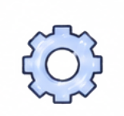
  &nbsp; toolbox
</h2>

<h3>languages</h3>

<table>
  <tr>
    <td align="center" width="110">
       
      Java
    </td>
    <td align="center" width="110">
       
      Python
    </td>
    <td align="center" width="110">
       
      TypeScript
    </td>
    <td align="center" width="110">
       
      JavaScript
    </td>
  </tr>
</table>

<h3>frontend</h3>

<table>
  <tr>
    <td align="center" width="110">
       
      React
    </td>
    <td align="center" width="110">
      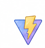 
      Vite
    </td>
  </tr>
</table>

<h3>backend</h3>

<table>
  <tr>
    <td align="center" width="110">
      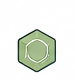 
      Node.js
    </td>
    <td align="center" width="110">
       
      FastAPI
    </td>
    <td align="center" width="110">
       
      Django
    </td>
  </tr>
</table>

<h3>cloud & data</h3>

<table>
  <tr>
    <td align="center" width="110">
       
      AWS
    </td>
    <td align="center" width="110">
       
      MySQL
    </td>
  </tr>
</table>

<h3>tools</h3>

<table>
  <tr>
    <td align="center" width="110">
      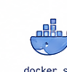 
      Docker
    </td>
    <td align="center" width="110">
      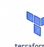 
      Terraform
    </td>
    <td align="center" width="110">
      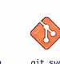 
      Git
    </td>
  </tr>
</table>

 

<h2>
  
  &nbsp; currently exploring
</h2>

&nbsp;&nbsp;
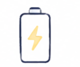
&nbsp;&nbsp;

&nbsp;&nbsp;

 

AWS · automated testing · Selenium · system design · IoT

 

<h2>
  
  &nbsp; let's connect
</h2>

<table>
  <tr>
    <td align="center" width="140">
      <a href="https://www.linkedin.com/in/lutriana/">
         
        LinkedIn
      </a>
    </td>

    <td align="center" width="140">
      <a href="https://luisasportfolio.io">
         
        Portfolio
      </a>
    </td>

    <td align="center" width="140">
      <a href="https://www.instagram.com/codesluli/">
         
        Instagram
      </a>
    </td>

    <td align="center" width="140">
      <a href="mailto:codesluli@gmail.com">
         
        Email
      </a>
    </td>
  </tr>
</table>

 

<samp>build · learn · improve · repeat ♡</samp>

<a href="mailto:codesluli@gmail.com">email</a>

 
 

<samp>build · learn · improve · repeat ♡</samp>

